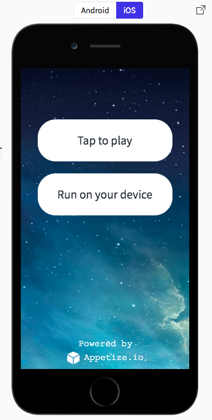

<div align="center">
 
 
</div>

<br/>


<br/>
<div align="center"><h3>React Native Picker Modal View<h3></div>
<div align="center">React Native Module to select item picker modal.</div>

<br/>

<div align="center">

[](https://codeclimate.com/github/pankod/react-native-picker-modal-view/maintainability)
[](https://codeclimate.com/github/pankod/react-native-picker-modal-view/test_coverage)
[](https://www.npmjs.com/package/react-native-picker-modal-view)
[](https://www.npmjs.com/package/react-native-picker-modal-view)
[](https://david-dm.org/pankod/react-native-picker-modal-view)
[](https://david-dm.org/pankod/react-native-picker-modal-view?type=dev)
[](https://travis-ci.com/pankod/react-native-picker-modal-view)

</div>
<br/>

<div align="center">
  <sub>Created by <a href="https://www.pankod.com">Pankod</a></sub>
</div>

<br/>

An alternative to [Picker](https://facebook.github.io/react-native/docs/picker) and [PickerIOS](https://facebook.github.io/react-native/docs/pickerios) components with an unified API and consistent look & feel on both plaforms. It's fully configurable and includes built-in support for text search and alphabetical index. Ideal for longer lists not suitable for "wheel-pickers".


## Getting started
```
$ npm install react-native-picker-modal-view --save
```

or

```
$ yarn add react-native-picker-modal-view
```

<!-- ## Usage -->


## Live Demo with Expo

<div align="center">

[](https://snack.expo.io/@pankod/github.com-pankod-react-native-picker-modal-view:example)

</div>

## Example

```javascript
import * as React from 'react';
import { Button, SafeAreaView, Text, View } from 'react-native';

import PickerModal from 'react-native-picker-modal-view';

import data from '../../../top20.json';

export default class Main extends React.Component<{}, { selectedItem: {} }> {

	constructor(props: {}) {
		super(props);

		this.state = {
			selectedItem: {}
		};
	}

	public render(): JSX.Element {
		const { selectedItem } = this.state;

		return (
			<SafeAreaView style={{ flex: 1, justifyContent: 'center', marginHorizontal: 20 }}>
				<PickerModal
					renderSelectView={(disabled, selected, showModal) =>
						<Button disabled={disabled} title={'Show me!'} onPress={showModal} />
					}
					onSelected={this.onSelected.bind(this)}
					onClosed={this.onClosed.bind(this)}
					onBackButtonPressed={this.onBackButtonPressed.bind(this)}
					items={data}
					sortingLanguage={'tr'}
					showToTopButton={true}
					selected={selectedItem}
					showAlphabeticalIndex={true}
					autoGenerateAlphabeticalIndex={true}
					selectPlaceholderText={'Choose one...'}
					onEndReached={() => console.log('list ended...')}
					searchPlaceholderText={'Search...'}
					requireSelection={false}
					autoSort={false}
				/>
				<View style={{ padding: 10, alignItems: 'center', backgroundColor: '#ddd' }}>
					<Text>Chosen: </Text>
					<Text>{JSON.stringify(selectedItem)}</Text>
				</View>
			</SafeAreaView>
		);
	}

	private onClosed(): void {
		console.log('close key pressed');
	}

	private onSelected(selected: any): void {
		this.setState({ selectedItem: selected });

		return selected;
	}

	private onBackButtonPressed(): void {
		console.log('back key pressed');
	}
}

```

<br/>

## Options
<br/>

| Properties                        | Type       | Description                                            | Default                                     |
| --------------------------------- | ---------- | ------------------------------------------------------ | ------------------------------------------- |
| **modalAnimationType**            | `string`   | The RN Modal show/hide animation type                  | `"slide"`                                   |
| **showAlphabeticalIndex**         | `boolean`  | Hides alphabetical index                               | `"true"`                                    |
| **onClosed**                      | `Function` | Fired when the modal is closed                         |                                             |
| **onBackButtonPressed**           | `Function` | Fired when the back key is pressed                     |                                             |
| **onSelected** <br> **required*   | `Function` | Returns selected item object                           | `"{Id, Name, Value, [key: string]: any}"`   |
| **items** <br> **required*        | `array`    | Array of list items                                    | `"[{Id, Name, Value, [key: string]: any}]"` |
| **renderSelectView**              | `Element`  | Render Select Component                                | `<SelectBoxComponent (built-in)>`           |
| **renderListItem**                | `Element`  | Render List item                                       | `<ListItemComponent (built-in)/>`           |
| **alphabeticalIndexChars**        | `array`    | Chracters array for the alphabetical index             | `<Turkish alphabet chracters>`              |
| **searchInputTextColor**          | `string`   | Search input placeholder text color                    | `"#252525"`                                 |
| **keyExtractor**                  | `Function` | Flatlist defined {key} function                        | `<Predefined return map index>`             |
| **autoGenerateAlphabeticalIndex** | `boolean`  | Auto-generates alphabetical index from list items data | `"false"`                                   |
| **sortingLanguage**               | `string`   | Country ISO (Alpha 2) Code for localeCompare           | `"tr"`                                      |
| **showToTopButton**               | `boolean`  | Button for scroll to offset 0                          | `"true"`                                    |
| **onEndReached**                  | `Function` | Fired when the list reaches the end                    |                                             |
| **selectPlaceholderText**         | `string`   | Select box placeholder text                            | `"Choose one..."`                           |
| **searchPlaceholderText**         | `string`   | Search input placeholder text                          | `"Search..."`                               |
| **selected**                      | `object`   | Default selected item                                  |                                             |
| **autoSort**                      | `boolean`  | Auto-sort data list                                    | `"false"`                                   |
| **disabled**                      | `boolean`  | Disable Select box                                     |                                             |
| **requireSelection**              | `boolean`  | Require at least one list item is selected             | `"false"`                                   |
| **backButtonDisabled**            | `boolean`  | Hide to back button             						  | `"false"`                                   |
| **renderSearch**            | `Function`  | Render custom search input             						  | ``                                   |

# Core Props of React Native
<br/>

| Properties           | Type     | Description                  | Default |
| -------------------- | -------- | ---------------------------- | ------- |
| **ModalProps**       | `object` | React Native Modal Props     |         |
| **FlatListProps**    | `object` | React Native Flatlist Props  |         |
| **SearchInputProps** | `object` | React Native TextInput Props |         |

<br/>
<br/>


## Running example project

1. You should have React Expo CLI to be installed in order to run example. Follow this [instructions](https://facebook.github.io/react-native/docs/getting-started) if you need to install Expo CLI.
<br/>
   

2. Install the dependencies:

```sh
npm install
```

3. Once the installation is done, you can run the following command:
 
 **npm**
 ```
 npm start
 ```
 You can also use:

 **expo**
  ```
 expo start
 ```

  **yarn**
  ```
 expo start
 ```
 <br/>

#### Notes

- Auto-alphabetical index supported for Turkish and English languages.

#### Releases

- 1.3.2 - Added renderSearch feature <a href="https://github.com/pankod/react-native-picker-modal-view/pull/54">#54</a> Thanks to @murilo-campaner
- 1.3.1 - Fixed <a href="https://github.com/pankod/react-native-picker-modal-view/issues/44">#44</a> Thanks to @fnando
- 1.3.0 - No back button support <a href="https://github.com/pankod/react-native-picker-modal-view/issues/42">#42</a> Thanks to @ChildishForces
- 1.2.8 - Fixed <a href="https://github.com/pankod/react-native-picker-modal-view/issues/37">#37</a>
- 1.2.6 - Deprecated lifecycle methods fix
- 1.2.5 - Flatlist initialNumToRender property hotfix
- 1.2.3 - Refactor and code coverage
- 1.2.2 - Fixed <a href="https://github.com/pankod/react-native-picker-modal-view/issues/5">#5</a>
- 1.2.0 - Added renderSelectView and renderListItem properties.
- 1.0.0 - Initial release


