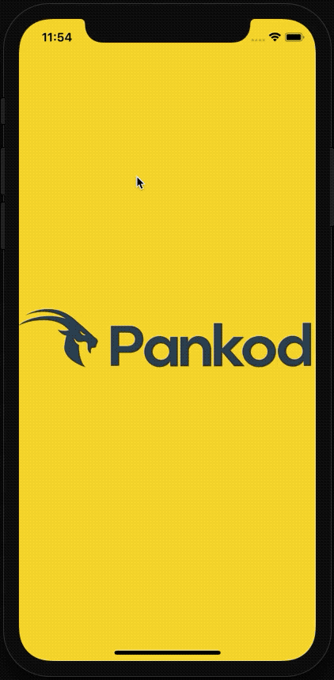
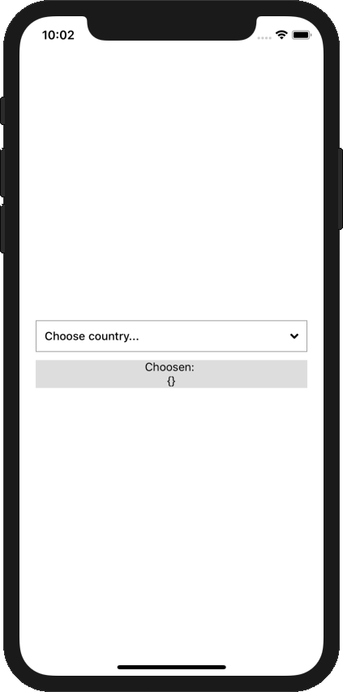
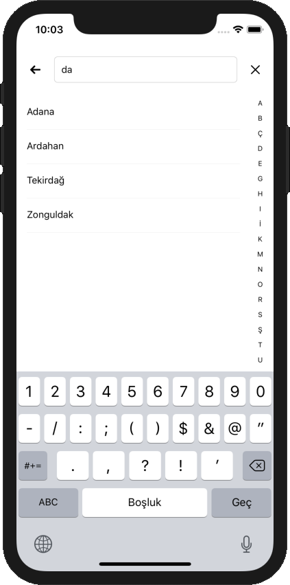
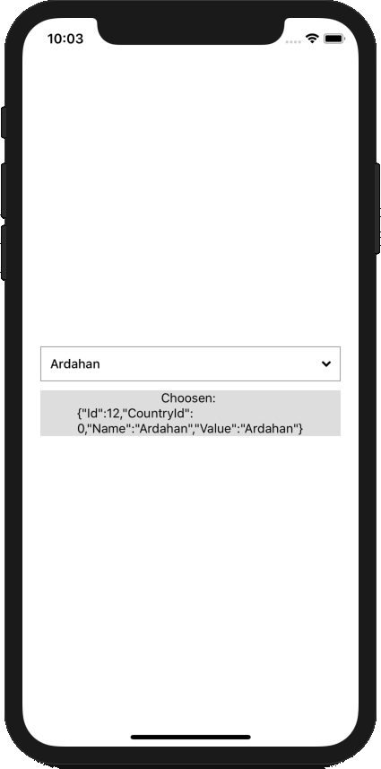

<div align="center">
 
</div>

<br/>

<div align="center">
 
  &nbsp;&nbsp;&nbsp;&nbsp;&nbsp;&nbsp;&nbsp;&nbsp;&nbsp;&nbsp;&nbsp;&nbsp;
 
 &nbsp;&nbsp;&nbsp;&nbsp;&nbsp;&nbsp;&nbsp;&nbsp;&nbsp;&nbsp;&nbsp;&nbsp;
 
</div>

<br/>
<div align="center"> <h3>React Native Picker Modal View<h3></div>

<div align="center">React Native Module to select item picker modal.</div>
<div align="center"> 
<br/>

[](https://www.npmjs.com/package/react-responsive-modal)
[](https://www.npmjs.com/package/react-responsive-modal)
[](https://david-dm.org/pradel/react-responsive-modal)


<br/>
  <sub>Created by <a href="https://www.pankod.com">Pankod</a></sub>
</div>
<br/>
<br/>


## Stores Supported:
|                                                                 **Apple App Store**                                                                 |                                                              **Google Play**                                                              |                                                                              |
| :--------------------------------------------------------------------------------------------------------------------------------------: | :-------------------------------------------------------------------------------------------------------------------------------------: | :----------------------------------------------------------------------------------------------------------
|                                                         **✓**                                                         |                                                        **✓**                                                        |                                                                                                                       |
|  |                       |
|                                             |


## Getting started
```
$ npm install react-native-picker-modal-view --save
```

or

```
$ yarn add react-native-picker-modal-view
```

<!-- ## Usage -->


## Example
```javascript
import React, { Component } from 'react';
import PickerModal from 'react-native-picker-modal-view';

const list = [
	{Id: 1, Name: 'Test1 Name', Value: 'Test1 Value'},
	{Id: 2, Name: 'Test2 Name', Value: 'Test2 Value'},
	{Id: 3, Name: 'Test3 Name', Value: 'Test3 Value'},
	{Id: 4, Name: 'Test4 Name', Value: 'Test4 Value'}
]

export default class example extends Component {

	constructor(props) {
		super(props);
		this.state = {
			selectedItem: {}
		}
	}

	selected(selected) {
		this.setState({
			selectedItem: selected
		})
	}

    render() {
        return (
		<PickerModal
			onSelected={(selected) => this.selected(selected)}
			onRequestClosed={()=> console.warn('closed...')}
			onBackRequest={()=> console.warn('back key pressed')}
			list={city}
			sortingLanguage={'tr'}
			showToTopButton={true}
			defaultSelected={this.state.selectedItem}
			autoCorrect={false}
			autoGenerateAlphabet={true}
			chooseText={'Choose one'}
			searchText={'Search...'} 
			forceSelect={false}
			autoSort={true}
		/>
        )
    }
}

```

<br/>

## Options
<br/>

| Properties | Type | Description |Default |
|------------|-------------------------------------|-------------|----------------------------------------------------------------|
| **animationType**   | `string` | The RN Modal animation type                | `"slide"`       | 
| **hideAlphabetFilter**   | `string` | Alphabets list in modal at right      | `"true"`        | 
| **onRequestClosed**   | `Function` | Function fired when the modal closed    
| **onBackRequest**   | `Function` | Function fired when the back key pressed          
| **onSelected** <br> **required* | `Function`  | Function return object when selected item | `"{ Id: string | number; Name: string; Value: string; [key: string]: any; CountryId?: ICity; CityId?: ITown; }"` | 
| **list** <br> **required* | `array`  | Array for list data | `"[{ Id: string | number; Name: string; Value: string; [key: string]: any; CountryId?: ICity; CityId?: ITown; }]"` | 
| **alphabets** | `array`  | Alphabets array to be listed | `"Predefined turkish alphabets"` | 
| **placeholderTextColor** | `string`  | Search input placeholder text color |  `"#252525"` | 
| **keyExtractor** | `Function`  | Flatlist defined {key} function |  `"Predefined return map index"` | 
| **autoGenerateAlphabet** | `boolean`  | Auto generate alphabets list from data list |  `"false"` | 
| **sortingLanguage** | `string`  | Country ISO (Alpha 2) Code for localeCompare |  `"tr"` | 
| **showToTopButton** | `boolean`  | Button for scroll to offset 0 |  `"true"` | 
| **onEndReached** | `Function`  | Function fired when the list end |  | 
| **FlatListProps** | `object`  | React Native Flatlist Props |  | 
| **SearchInputProps** | `object`  | React Native TextInput Props |  | 
| **ModalProps** | `object`  | React Native Modal Props |  | 
| **chooseText** | `string`  | Select box placeholder text | `"Choose one..."` | 
| **searchText** | `string`  | Search input placeholder text | `"Search..."` | 
| **defaultSelected** | `object`  | Predefined selected object |  | 
| **autoCorrect** | `boolean`  | Auto correct for search input | `"true"` | 
| **autoSort** | `boolean`  | Auto sort data list | `"false"` | 
| **style** | `object`  | In the future list... |  | 
| **disabled** | `boolean`  | Select box disabled boolean |  | 
| **forceSelect** | `boolean`  | Force the user select anyone | `"false"` |  

<br/>
<br/>


#### Notes

- As of version 1.0.0 this package is compatible with both iOS and Android.
- Auto alphabets sorting support for Turkish and English

#### Releases
- 1.0.0 - Initial release


